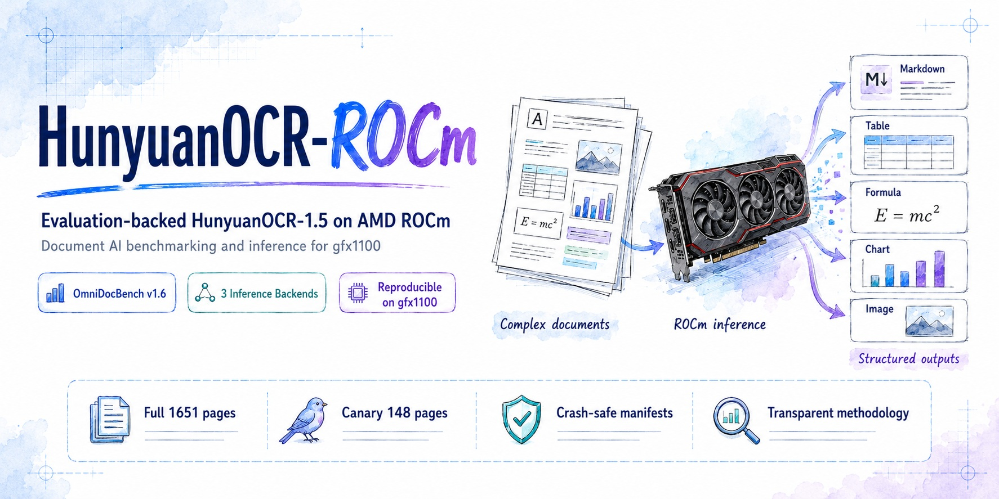

# HunyuanOCR-ROCm



> Evaluation-backed AMD ROCm port of [HunyuanOCR-1.5](https://github.com/Tencent-Hunyuan/HunyuanOCR)
> — runs the model on AMD gfx1100 (RDNA3) across three inference backends and
> reports OmniDocBench v1.6 results. **Not** a precision-aligned port: the
> official headline is measured with a different engine (TensorRT). See [Benchmark methodology](docs/benchmark-methodology.md).

[](https://github.com/opendatalab/OmniDocBench)
[](reports/canary-baseline.md)
[](reports/project-stage-summary.md)
[](docs/benchmark-methodology.md)
[-blue)](NOTICE)

## At a glance

- **What it is.** Tooling to run Tencent HunyuanOCR-1.5 on AMD ROCm and score it
  on OmniDocBench v1.6, across three inference backends (llama.cpp, vLLM,
  transformers) with a frozen decoding contract.
- **Where verified.** AMD **gfx1100 (RDNA3, 48 GB ×4), ROCm 7.2**, bf16.
- **Most reliable formal result.** **llama.cpp full 1651 pages = 92.09 Overall**
  (1651/1651 complete, scored twice).
- **Most important limitation.** **Not precision-aligned:** the official 94.10
  headline is measured with
  **TensorRT** (a different engine) on an unlabeled OmniDocBench version. The
  vLLM full-set run was previously **invalid** (server crashes) but is **now
  validated at 91.31 Overall** (2026-07-25) — see
  [vLLM full-set validation](#vllm-full-set-validation-2026-07-25).
- **Fastest path to one page.** [Quick start (llama.cpp)](#quick-start-llamacpp-recommended)
  — warm ~1.4 s/page on a single GPU.

## Results

AMD gfx1100 (RDNA3, 48 GB ×4, ROCm 7.2), bf16, OmniDocBench v1.6. Two
**separate** page sets are reported below — they are never mixed into one
column, because their numbers are not comparable. Full provenance and the
definition of "precision-aligned" are in [Benchmark methodology](docs/benchmark-methodology.md).

<!-- BEGIN GENERATED RESULTS -->
<!-- Auto-generated from REPRO.yaml by scripts/render_benchmark_tables.py (do not edit by hand). -->

| Page set | Backend | Overall | Source |
|---|---|---|---|
| canary 148 | llama.cpp | 93.33 | REPRO.yaml |
| canary 148 | transformers | 94.11 | REPRO.yaml |
| canary 148 | vLLM | 94.81 | REPRO.yaml |
| full 1651 | llama.cpp | 92.09 | REPRO.yaml |
| full 1651 | transformers | 94.05 | REPRO.yaml |
| full 1651 | vLLM | 91.31 | REPRO.yaml |
| official | TensorRT | 94.10 | official HunyuanOCR table |

<!-- END GENERATED RESULTS -->

### Table A — same 148-page canary, three ROCm backends

| Backend | Overall | text EditDist↓ | formula CDM↑ | table TEDS↑ | order EditDist↓ | Resolution | Status |
|---|---|---|---|---|---|---|---|
| **vLLM** 0.16.1 (Flash-Attn ViT) | **94.81** | 0.0514 | 0.9648 | 0.9308 | 0.1135 | capped 3.4M | 148/148 complete |
| transformers 5.13.0 (SDPA ViT) | 94.11 | 0.0437 | 0.9425 | 0.9246 | 0.1184 | capped 3.4M | 148/148 complete |
| **llama.cpp** (C++ GGML, BF16 GGUF) | 93.33 | 0.0512 | 0.9083 | 0.9429 | 0.1270 | uncapped | 148/148 complete |

Overall = `((1−text)·100 + CDM·100 + TEDS·100)/3`; order EditDist is reported
separately and is **not** part of Overall.

### Table B — full 1651-page set (OmniDocBench v1.6)

| Backend / source | Overall | text EditDist↓ | formula CDM↑ | table TEDS↑ | Inference engine | Notes |
|---|---|---|---|---|---|---|
| **llama.cpp** (this repo, gfx1100/ROCm) | **92.09** | 0.0467 | 0.8964 | 0.9130 | llama.cpp C++ GGML (HIP) | 1651/1651, 0 errors; scored twice |
| Official HunyuanOCR (OmniDocBench) | **94.10** | 0.042 | 0.9473 | 0.9181 | **TensorRT** | [official table](https://github.com/Tencent-Hunyuan/HunyuanOCR) |
| Δ (ours − official) | −2.01 | +0.0047 | −0.0509 | −0.0051 | different engine | not a precision comparison |

> The **−2.01 gap is not a measured engine-level delta.** The official number uses
> a third inference engine (TensorRT) and an unlabeled dataset version; ours uses
> llama.cpp on v1.6. A **94.74** figure quoted in some third-party summaries is
> **not** in the official benchmark table and is treated as `not_verified`.

> **vLLM full-set: VALIDATED (2026-07-25) — 91.31 Overall.** Root-caused and
> fixed: (1) server `--max-model-len 32768` was too small → raised to 65536;
> (2) missing `--max-pixels 3400000` ViT cap → large pages errored; (3) concurrency
> collapses throughput → run sequential (compiled, ~7 s/page). Result on the full
> 1651: **text 95.48% · table TEDS 86.00% · formula CDM 92.46% (2352 formulas, 0
> exceptions) · Overall 91.31 · 0 errors**. CDM required a full host toolchain
> (TUG TeX Live 2025 + CJK/gkaiu + latexmlc + ImageMagick 7 + the `#mathcolor`
> patch); one-shot reprovisioner: `provision_cdm_host.sh` (eval-workspace script).
> Comparable to llama.cpp (92.09, uncapped full-res).

**Key findings:**
- **Among the three tested backends, on the tested gfx1100/ROCm 7.2 stack**, llama.cpp is the fastest and most stable, and the only one of the three that runs with no pixel cap (full resolution). Its C++ ViT is deterministic at >14k vision tokens.
- The **formula CDM gap** (~5.65 pts vLLM-vs-llama.cpp on the canary): after ruling out resolution, streaming, post-processing, and systematic formula omission, **inference-engine-level numerical divergence is the leading explanation** — not a singly-proven root cause ([analysis](docs/tencent-114-followup3-draft.md)).
- The **>14k ViT instability** is a sharp threshold (~14,200 patches) **observed in the transformers/ROCm full-ViT path using SDPA on the tested gfx1100 stack**; a standalone SDPA op does not reproduce it, so it is **not pinned to a single SDPA kernel**, and there is no NVIDIA control to bound it to ROCm ([ROCm issue #6416](https://github.com/ROCm/ROCm/issues/6416)). It is not observed in vLLM's Flash-Attention or llama.cpp's C++ GGML paths.

## vLLM full-set validation (2026-07-25)

The vLLM full-set — previously documented as "invalid" (servers crashed, ~780
ERROR pages, excluded 46.31) — is **now a valid, comparable result** after fixing
three crash root causes and standing up the CDM toolchain on the host.

**Result** (OmniDocBench v1.6, full 1651 pages, gfx1100/ROCm, capped 3.4 Mpx,
compiled vLLM, sequential):

| Metric | Value |
|---|---|
| text_block Edit_dist → accuracy | 0.0452 → **95.48%** |
| table TEDS | **86.00%** |
| formula CDM (2352 formulas, 0 exceptions) | **92.46%** |
| **Overall = ((1−text)·100 + CDM·100 + TEDS·100)/3** | **91.31** |
| hard errors | 0 / 1651 |

**Root causes fixed** (the original "invalid"):
1. Server `--max-model-len 32768` was too small — input + 32768 output tokens
   overflowed the context (mass 400 errors). Fix: **65536** (the `serve_vllm.sh`
   tuned default).
2. No `--max-pixels` ViT cap — 56% of OmniDocBench pages exceed 3.4 Mpx and
   exceed the gfx1100 ViT / encoder-cache limit. Fix: **`--max-pixels 3400000`**.
3. Concurrency collapses vLLM throughput on this stack (5 concurrent = 209 s for
   5 small pages; single request = ~7 s/page). Fix: run **sequential
   (concurrency 1)**; compiled (torch.compile) is stable at ~100 tok/s — the
   earlier "torch.compile stalls" note is stale.

**CDM toolchain (host):** CDM silently scored 0 until the full chain was in
place — Debian `texlive-full` lacks the Arphic `gkai` font, and TL2025's
`xcolor` swallows `\mathcolor`. Required: official **TUG TeX Live 2025** +
`cjk`/`arphic` gkaiu (+ `xcolor`/`amsmath`/`upgreek`/…) + `gkaiu` in
`pdftex.map` + **`latexmlc`** (LaTeXML) + **ImageMagick 7** + the **`#mathcolor`
patch** in the OmniDocBench checkout. One-shot, idempotent, re-runnable after
pod rebuild: **`provision_cdm_host.sh`** (eval-workspace reprovisioner; all 7 steps).
Failure-mode analysis: `omnidocbench-rocm/docs/pitfalls.md` (#cdm-zero tree).

> vLLM full-set (91.31, capped 3.4 Mpx) remains slightly below llama.cpp
> (92.09, uncapped full-res) — the pixel cap costs table/dense-page quality.
> **llama.cpp is still the recommended backend for the best score; vLLM is now a
> valid alternative.**

## Hardware support

> Full per-GPU matrix (verified / community / unknown): see
> [docs/hardware-matrix.md](docs/hardware-matrix.md). Only gfx1100/ROCm 7.2 is
> maintainer-verified; everything else is honestly marked.

| Use case | Status | Notes |
|---|---|---|
| Single-GPU inference — llama.cpp (HIP) | ✅ Verified | gfx1100 48 GB; warm ~1.4 s/page |
| 4-GPU full-set throughput — llama.cpp | ✅ Verified | one server/GPU; full 1651 in ~hours |
| vLLM canary (148) | ✅ Verified | 94.81 Overall |
| transformers canary (148) | ✅ Verified | 94.11 Overall |
| vLLM full-set (1651) | ✅ Validated | **91.31 Overall** (capped 3.4M, sequential); see [validation](#vllm-full-set-validation-2026-07-25) |
| transformers full-set (1651) | ⚠️ Not verified | ~40 h, impractical |
| Minimum VRAM | ❔ Unknown | not measured — do **not** assume a number |
| Other RDNA3 / non-gfx1100 | ❔ Unknown | not tested; file a ROCm-compat issue |

A single gfx1100 is sufficient for inference and the canary; 4 GPUs are only
needed for full-set throughput, not for correctness.

## ⚖️ License — read before downloading weights

Before downloading or using the weights, review the **Tencent Hunyuan Community
License** ([LICENSES/LicenseRef-Tencent-Hunyuan-Community-License.txt](LICENSES/LicenseRef-Tencent-Hunyuan-Community-License.txt),
[official](https://github.com/Tencent-Hunyuan/HunyuanOCR)). **The license does
not apply in the EU, UK, or South Korea**, and it is **not OSI Open Source**.
See [NOTICE](NOTICE) for the full mixed-license breakdown. Original
packaging/tooling in this repo is Apache-2.0; code ported from HunyuanOCR and the
weights are under the Tencent Hunyuan Community License.

## Quick start (Demo + Install)

This runs the model on a local gfx1100 and scores it on one OmniDocBench v1.6
page set. You use **two terminals**: Terminal A runs the inference server;
Terminal B runs predict → validate → score. Every command uses absolute paths
derived from the variables below, so neither terminal depends on your current
directory.

### Step 0 — Clone the repository (once, in either terminal)

```bash
git clone https://github.com/AIwork4me/HunyuanOCR-ROCm.git
cd HunyuanOCR-ROCm
```

### Step 1 — Define environment variables (run in BOTH terminals)

From the repo root you just entered (`HunyuanOCR-ROCm/`):

```bash
export HUNYUAN_ROCM_DIR="$PWD"
export LLAMA_DIR="$HUNYUAN_ROCM_DIR/third_party/llama.cpp"     # llama.cpp build
export GGUF_DIR="$HUNYUAN_ROCM_DIR/models/HunyuanOCR-GGUF"     # downloaded weights
export DATA_DIR="/path/to/OmniDocBench_data"                   # GT json + images/
```

Set `DATA_DIR` to your local OmniDocBench v1.6 data directory.

### Step 2 — Install (CPU-only core; no torch pulled from PyPI)

```bash
# in $HUNYUAN_ROCM_DIR (shared by both terminals)
pip install -e ".[client,download]"      # core + openai client + hf downloader; NO torch
# developers: pip install -e ".[client,download,dev]"
```

> ROCm PyTorch is **not** a dependency and is **not** installed by the above — it
> is only needed for the transformers/vLLM backends. Install it separately from a
> verified ROCm wheel source for your stack. The llama.cpp backend needs no torch.

### Terminal A — Build llama.cpp with HIP on gfx1100

```bash
# uses $LLAMA_DIR explicitly — current directory does not matter
git clone https://github.com/ggml-org/llama.cpp.git "$LLAMA_DIR"
cd "$LLAMA_DIR"
git checkout a320cbfcb7056b7b81fb854d97fe01d0ea77c4b5
# locked commit for the published results (see REPRO.yaml)
HIPCXX=/opt/rocm/llvm/bin/clang HIP_PATH=/opt/rocm \
cmake -S . -B build -DGGML_HIP=ON -DGPU_TARGETS=gfx1100 \
  -DGGML_HIP_ROCWMMA_FATTN=ON -DCMAKE_BUILD_TYPE=Release -DLLAMA_CURL=ON
cmake --build build --config Release -j$(nproc) --target llama-server
```

> **`latest` master is not guaranteed to reproduce** the published numbers — always
> check out the locked commit above. If your ROCm stack lacks the **rocWMMA**
> headers, fall back to a non-rocWMMA build: drop `-DGGML_HIP_ROCWMMA_FATTN=ON`
> (slower, but functional).

### Terminal A — Download the BF16 GGUF and verify its hash

```bash
# uses $GGUF_DIR explicitly — current directory does not matter
hf download ggml-org/HunyuanOCR-GGUF \
  HunyuanOCR-bf16.gguf mmproj-HunyuanOCR-bf16.gguf \
  --local-dir "$GGUF_DIR"
sha256sum "$GGUF_DIR"/*.gguf
# compare against REPRO.yaml -> model.benchmark_artifact
```

### Terminal A — Run the server (loopback only)

```bash
# one server per GPU for throughput; here, one on port 8081
"$LLAMA_DIR/build/bin/llama-server" \
  --model "$GGUF_DIR/HunyuanOCR-bf16.gguf" \
  --mmproj "$GGUF_DIR/mmproj-HunyuanOCR-bf16.gguf" \
  --host 127.0.0.1 --port 8081 --alias HYVL \
  -ngl 999 -c 65536 -n 32768
```

> **Network safety.** `llama-server` has **no default strong authentication**. The
> default bind is `127.0.0.1` (loopback only). For remote access, put a reverse
> proxy with authentication in front and restrict it with a firewall — **do not
> expose the server to the public internet**. The `-c 65536` context is required
> for large uncapped images (32768 overflows). Leave this running in Terminal A.

### Terminal B — Predict → validate → score on OmniDocBench v1.6

All commands run **from `$HUNYUAN_ROCM_DIR`** (the repo root) — they never depend
on you being inside `llama.cpp`.

```bash
cd "$HUNYUAN_ROCM_DIR"

# (optional) materialize the 148-page canary from the full GT, byte-identically:
hunyuan-ocr canary materialize \
  --full-gt "$DATA_DIR/OmniDocBench.json" \
  --manifest "$HUNYUAN_ROCM_DIR/eval/canary_148.manifest.json" \
  --out "$DATA_DIR/OmniDocBench_canary_148.json"

# predict (note --backend-name llamacpp; --ports must match Terminal A)
python scripts/run_inference.py \
  --backend-name llamacpp --server-alias HYVL \
  --gt-json "$DATA_DIR/OmniDocBench_canary_148.json" \
  --images-dir "$DATA_DIR/images" \
  --pred-dir "$HUNYUAN_ROCM_DIR/artifacts/predictions" \
  --host 127.0.0.1 --ports 8081 --model HYVL --concurrency 8

# validate (blocks scoring on missing/empty/ERROR pages)
python scripts/validate_predictions.py \
  --gt-json "$DATA_DIR/OmniDocBench_canary_148.json" \
  --pred-dir "$HUNYUAN_ROCM_DIR/artifacts/predictions"

# score (requires the OmniDocBench scorer venv; see REPRO.yaml)
python scripts/score_predictions.py \
  --pred-dir "$HUNYUAN_ROCM_DIR/artifacts/predictions" \
  --gt-json "$DATA_DIR/OmniDocBench_canary_148.json"
```

The same steps are available via the unified CLI
(`hunyuan-ocr doctor | validate | manifest verify | canary materialize | predict | score`);
`predict` and `score` work from a wheel install too. Run `hunyuan-ocr doctor` to
check your environment, or `hunyuan-ocr doctor --strict --backend llamacpp --json`
for a CI-friendly gate.

## Architecture

> Contributor orientation (pipeline + per-module roles, 5-minute read):
> [docs/architecture.md](docs/architecture.md).

```
src/hunyuan_ocr/
├── contract.py           # FROZEN decoding contract (prompt, sampling, image config)
├── tasks.py              # 12 task prompts (verbatim port from upstream)
├── postprocess.py        # clean_repeated_substrings + process_one (verbatim port)
├── runner.py             # atomic writes, resumability, run-manifest, writer lock
├── validation.py         # pre-score prediction-dir validation
├── preflight.py          # input validation + sharding (fail before model load)
├── endpoint_pool.py      # circuit-breaking OpenAI-compatible endpoint pool
├── scoring.py            # OmniDocBench config writer + scorer + result parser
├── canary.py             # rebuild the 148-page canary from the full GT
├── cli.py                # unified `hunyuan-ocr` CLI
├── omnidocbench.py       # dataset iteration + prediction filename mapping
└── backends/
    ├── transformers.py   # transformers backend (Phase 1 oracle)
    └── vllm_client.py    # OpenAI-compatible client (vLLM / llama-server / any OAI)

scripts/
├── run_inference.py            # OpenAI-compatible driver (llama.cpp/vLLM); canonical name
├── run_openai_compatible.py    # generic alias of run_inference.py
├── run_phase2_vllm.py          # back-compat shim → run_inference.py
├── run_phase1_transformers.py  # multi-GPU transformers driver (via `hunyuan-ocr predict --backend transformers`)
├── serve_vllm.sh               # start a vLLM server (HIP, compiled, tuned)
├── score_predictions.py / validate_predictions.py # score / validate wrappers
├── reproduce_llamacpp_{canary,full}.sh            # locked-commit reproduce scripts
├── create_canary_manifest.py   # (re)generate eval/canary_148.manifest.json
└── check_repo.py               # CI integrity checks (lock, manifest, links, SPDX)

eval/canary_148.manifest.json   # the 148 canary pages (file order) + source-GT SHA256
REPRO.yaml       # pinned inputs: commits, GT/model SHA256, env, metrics
reports/                        # canary BASELINE + stage summary (Historical)
LICENSES/  NOTICE  .github/workflows/   # mixed-license texts + CI
```

> Internal design/planning notes live under `docs/superpowers/` and are **not**
> part of the user-facing architecture.

## gfx1100 adaptations

| Adaptation | Reason | Where |
|---|---|---|
| ViT pixel cap (3.4M, `HUNYUANOCR_VIT_MAX_PIXELS`) | ROCm SDPA ViT NaN above ~14.2k tokens ([#6416](https://github.com/ROCm/ROCm/issues/6416)) | `backends/transformers.py` |
| SDPA attention (vs eager) | ~1.4× faster on RDNA3 | `backends/transformers.py` |
| torch.compile for vLLM | ~28× decode speedup (2→150 tok/s) | `scripts/serve_vllm.sh` |
| `-c 65536` for **llama-server** | large pages overflow 32768 ctx at full res | `scripts/reproduce_llamacpp_*.sh` (llama-server flags) |

## Issues filed

- **[ROCm/ROCm#6416](https://github.com/ROCm/ROCm/issues/6416)** — bf16 ViT forward non-determinism + NaN above ~14.3k tokens on gfx1100.
- **[Tencent-Hunyuan/HunyuanOCR#114](https://github.com/Tencent-Hunyuan/HunyuanOCR/issues/114)** — recommended max resolution / vision-token budget; three-backend comparison data; formula CDM gap analysis.

## Reproducibility & Known Gaps

- **Benchmark release artifacts:** each release ships an evidence bundle
  (`run_manifest.json`, `metrics.json`, `environment.json`, the lock, `commands.txt`,
  `checksums.sha256`) so a number is reproducible from recorded inputs — see
  [docs/release-artifact.md](docs/release-artifact.md).
- **Lock file (single source of truth):** [`REPRO.yaml`](REPRO.yaml)
  pins every verified input for the published results — the repo + llama.cpp +
  OmniDocBench commits, the GT/model SHA256s, **and** the HF model/GGUF revisions
  and LFS OIDs (cross-checked byte-for-byte against the official repos), the env
  versions, and the Overall metric formula. The exact model revisions, LFS OIDs,
  and artifact SHA256 values are recorded there as the machine-readable source of
  truth, so they are not duplicated here.
- **Canary manifest:** [`eval/canary_148.manifest.json`](eval/canary_148.manifest.json)
  lists the 148 canary pages **in file order** with the source-GT SHA256.
  Regenerate with `scripts/create_canary_manifest.py`; rebuild the canary subset
  byte-identically from the full GT with `hunyuan-ocr canary materialize`.
- **Reproduce scripts:** `scripts/reproduce_llamacpp_canary.sh` (148) and
  `scripts/reproduce_llamacpp_full.sh` (1651) run predict → validate → score →
  verify-manifest against the locked llama.cpp commit, binding `127.0.0.1`.
  `RESUME=1` continues an existing run; `OVERWRITE=1` redoes it. Set
  `LLAMA_DIR/GGUF_DIR/DATA_DIR/OUT_DIR`.
- **Which numbers are formal vs diagnostic:**
  - **Formal/reliable:** llama.cpp full 1651 = **92.09**; canary vLLM 94.81, transformers 94.11, llama.cpp 93.33.
  - **Diagnostic only:** the >14k ViT isolation, throughput tuning, formula-CDM ablation.
  - **Invalid (excluded):** vLLM full-set 46.31 (server crashes, ~780 ERROR pages).
- **Why newer deps may differ:** the benchmark used transformers 5.13.0 in an isolated
  venv; a current install may have a different transformers/torch/vLLM and can produce
  different numbers, especially around the >14k ViT path and formula CDM.

## License

This repository is **mixed-licensed** (see [NOTICE](NOTICE)):

1. **Original packaging/tooling** (`runner.py`, `validation.py`, `scoring.py`, `omnidocbench.py`, `endpoint_pool.py`, `preflight.py`, `canary.py`, `cli.py`, drivers, scripts): **Apache-2.0** ([LICENSE](LICENSE), [LICENSES/Apache-2.0.txt](LICENSES/Apache-2.0.txt)).
2. **Code ported from HunyuanOCR** (`contract.py`, `tasks.py`, `postprocess.py`, `backends/*`): upstream-derived portions under the **Tencent Hunyuan Community License** ([LICENSES/LicenseRef-Tencent-Hunyuan-Community-License.txt](LICENSES/LicenseRef-Tencent-Hunyuan-Community-License.txt)) — *not* Apache.
3. **HunyuanOCR model weights** (`tencent/HunyuanOCR`, `ggml-org/HunyuanOCR-GGUF`): **Tencent Hunyuan Community License** — **not OSI Open Source**; excludes EU/UK/KR; "Powered by Tencent Hunyuan" is *encouraged*, not required.
4. **llama.cpp**: MIT. **vLLM**: Apache-2.0.

Tencent is not affiliated with, sponsoring, or endorsing this project.

## Acknowledgements

- [Tencent HunyuanOCR](https://github.com/Tencent-Hunyuan/HunyuanOCR) — the model.
- [ggml-org/llama.cpp](https://github.com/ggml-org/llama.cpp) — the inference engine.
- [vLLM](https://github.com/vllm-project/vllm) — the serving backend.
- [OmniDocBench](https://github.com/opendatalab/OmniDocBench) — the evaluation benchmark.
- [ROCm](https://github.com/ROCm/ROCm) — the AMD compute platform.

<!-- BEGIN ROCMDOC GENERATED RESULTS -->
| Backend | Platform | Pages | Overall | Assurance | Status | Result ID |
|---|---|---|---|---|---|---|
| llama-cpp | linux-rocm | 1651 | 92.09 | submitted | valid | `hunyuan-ocr__linux-rocm__llama-cpp__bf16__v1-6__9afe77319b08` |
| vllm | linux-rocm | 1651 | 93.64 | evidence-complete | valid | `hunyuan-ocr__linux-rocm__vllm__bf16__v1-6__38a99096c23d` *(primary)* |

> Generated from `model_card_v2.json` (single source of truth). Overall is the raw-evidence-derived value; external/experimental references live in `docs/benchmark-context.md`.
<!-- END ROCMDOC GENERATED RESULTS -->
